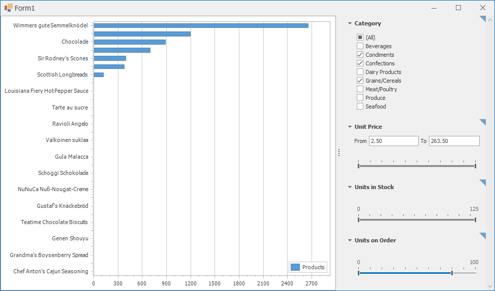

<!-- default badges list -->

<!-- default badges end -->

# Chart for WinForms - How to Filter a Chart with the Filtering UI Context

This example demonstrates how to filter a series data source with the `FilterCriteria` property in the [UI](https://docs.devexpress.com/WindowsForms/114877/common-features/filtering-ui-context).

## Files to Review

* [Category.cs](./CS/FilterCriteriaSample/DataModel/Category.cs) (VB: [Category.vb](./VB/FilterCriteriaSample/DataModel/Category.vb))
* [Product.cs](./CS/FilterCriteriaSample/DataModel/Product.cs) (VB: [Product.vb](./VB/FilterCriteriaSample/DataModel/Product.vb))
* [FilterViewModel.cs](./CS/FilterCriteriaSample/FilterViewModel.cs) (VB: [FilterViewModel.vb](./VB/FilterCriteriaSample/FilterViewModel.vb))
* [Form1.cs](./CS/FilterCriteriaSample/Form1.cs) (VB: [Form1.vb](./VB/FilterCriteriaSample/Form1.vb))

## Documentation

* [Filter Series Data](https://docs.devexpress.com/WindowsForms/6171/controls-and-libraries/chart-control/data-representation/filter-series-data)
<!-- feedback -->
## Does this example address your development requirements/objectives?

 

(you will be redirected to DevExpress.com to submit your response)
<!-- feedback end -->
